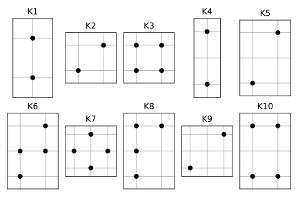

# Wolff algorithm for the Ising model

This code implements two things
1. The Wolff algorithm for the nearest-neighbor Ising model.
2. A basic Metropolis Hasting step on top of the Wolff algorithm if the Hamiltonian includes (small) perturbations in coupling constants.

The code generally supports any dimension of lattice, however the included coupling terms (K1, K2, ...) are specifically for 2D.
Cyclical boundary conditions are used.

## 2D Couplings
A list of 2D couplings up to order 4 (i.e. coupling 4 lattice sites) is included.
Each coupling includes all equivalent combinations of sites under D4 symmetry.
For example, K1 corresponds to the sum 
$\sum_{ij} \sigma_{i,j}\sigma_{i,j+1} + \sigma_{i,j}\sigma_{i+1,j} \,,$
where $i$ and $j$ range over the lattice indices and using cyclical boundary conditions.



## Example

Generating samples from the critical temperature Ising model with nearest neighbor coupling:
```julia
lattice_shape = (32, 32)
β = IsingWolff.βc  # critical inverse temperature
count = 50  # number of samples to generate
save_every = 100  # Wolff steps between saved samples
therm = 500000  # thermalization steps
samples = IsingWolff.wolffsample(lattice_shape, β, count, save_every, therm)
```
This will return a sample of type ``50×32×32 Array{Int64, 3}``.
If memory is an issue, a samples array of desired type, e.g. a ``BitARray``, can be pre-allocated:
```julia
samples = BitArray{3}(undef, count, lattice_shape...)
samples = IsingWolff.wolffsample!(samples, lattice_shape, β, count, save_every, therm)
```


We can also generate samples for a perturbed Hamiltonian with $\delta H[\sigma] = 0.1 \, K_2[\sigma]$:
```julia
coup = [IsingWolff.K2]  # coupling specification
coup_const = [0.01]
samples, accept_rate = IsingWolff.wolffsample((32, 32), IsingWolff.βc, coup_const, coup, 50, 100, 5000)
```
This uses a Wolff sampler with the given β as proposal, correcting for the perturbed coupling constants with a Metropolis Hastings accept/reject step.
The larger the coupling constants, the further the target theory is from the nearest-neighbor samples generated with Wolff's algorithm, and the smaller the acceptance rate becomes.